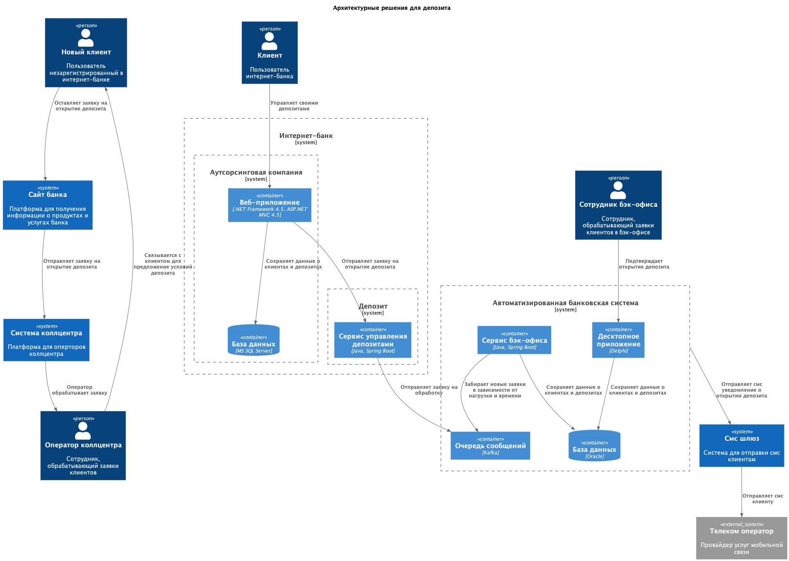

### **Название задачи:**

### **Автор:**

### **Дата:**

### **Функциональные требования**

Опишите здесь верхнеуровневые Use Cases. Их нужно оформить в виде таблицы с пошаговым описанием:

| **№** | **Действующие лица или системы**                                  | **Use Case**                 | **Описание**                                                                                                                                                                                                                                                                                                         |
| :---: | :---------------------------------------------------------------- | :--------------------------- | :------------------------------------------------------------------------------------------------------------------------------------------------------------------------------------------------------------------------------------------------------------------------------------------------------------------- |
|  UC1  | Новый Клиент Оператор коллцентра Сайт Система коллцентра | Оформление заявки на депозит | 1. Новый пользователь переходит на сайт. 2. Пользователь оставляет номер телефона и ФИО. 3. Оператор коллцентра изучает заявку в системе коллцентра. 4. Оператор коллцентра звонит клиенту с предложением особых условий. 5. Новый клиент приходит в отделение для идентификации.                        |
|  UC2  | Клиент Интернет-банк Смс шлюз АБС Сотрудник бэк-офиса | Открытие депозита            | 1. Клиент видит в интернет-банке список доступных депозитов с персонализированными ставками. 2. Клиент выбирает депозит и указывает счет и сумму. 3. Клиент подтверждает открытие депозита смс-кодом. 4. Сотрудник бэк-офиса обрабатывает заявку в системе АБС. 5. Клиент получает подтверждение по смс. |

### **Нефункциональные требования**

Опишите здесь нефункциональные требования и архитектурно значимые требования.

| **№** | **Требование**                                                                                       |
| :---: | :--------------------------------------------------------------------------------------------------- |
|  R1   | Сервисы должны работать 24/7                                                                         |
|  R2   | Доступность составляет сервисов 99,9%                                                                |
|  P1   | Отклики по всем операциям должны быть < 1 секунды                                                    |
|  R1   | Сайт должен использовать шифрование трафика                                                          |
|  R2   | Интернет-банк должен использовать систему шифрования данных                                          |
|  R4   | Для баз данных следует использовать MS SQL и Oracle                                                  |
|  R5   | В рамках добавления открытия депозитов в интернет-банке стоит реализовать микросервисную архитектуру |
|  R6   | При добавлении микросервисной архитектуры использовать Kafka для очередей.                           |
|  R7   | Следует максимально избегать увеличение нагрузки на АБС и не использовать ее API напрямую            |
|  R8   | Для интернет-банка использовать Kubernetes для горизонтального масштабирования                       |

### **Решение**

> Приведите диаграммы контекста и контейнеров в модели C4. Опишите там основные компоненты и интеграции всех элементов решения.
> Также опишите, какой логикой вы руководствовались в ходе принятия решений и выбора технологий. Не забывайте, что необходимо учесть все функциональные и нефункциональные требования.

Диаграмма: [ссылка на диаграмму](c4.puml)

- Старое веб-приложение монолитное и имеет сложности с подключение нового функционала (например Kafka, микросервисы и т.д.). Поэтому можно сделать новый сервис, в который будут перенаправлятся заявки на открытие депозитов, и обрабатывать их. Это позволит не трогать старое приложение.
- В будущем можно будет постепенно переносить функционал из старого приложения в новый сервис, а также добавлять новый функционал, не затрагивая старое приложение.
- Новый сервис отправляет заявки в очередь, а сервис бэк-офиса забирает их в зависимости от нагрузки и времени. Это позволит не нагружать АБС и не использовать ее API напрямую, а также обеспечить высокую доступность и масштабируемость.

### **Альтернативы**

- Масштабирование старого монолитного приложения. Это может быть сложно и дорого, а также может привести к увеличению времени отклика и снижению доступности.

**Недостатки, ограничения, риски**

- При увеличение нагрузки на старое веб-приложение, может возникать проблема во всей система, так как оно живет в одном ЦОД с более важными сервисами, например АБС. Поэтому стоит максимально мониторить нагрузку на старое приложение и при необходимости масштабировать его.

