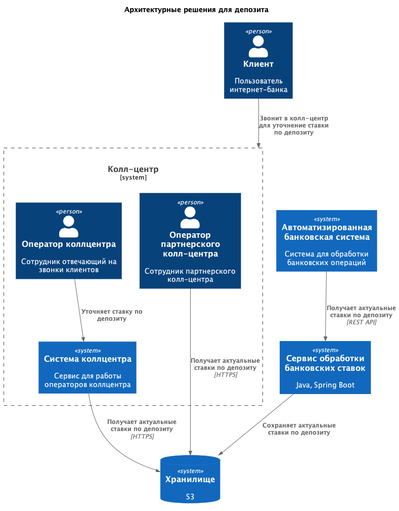
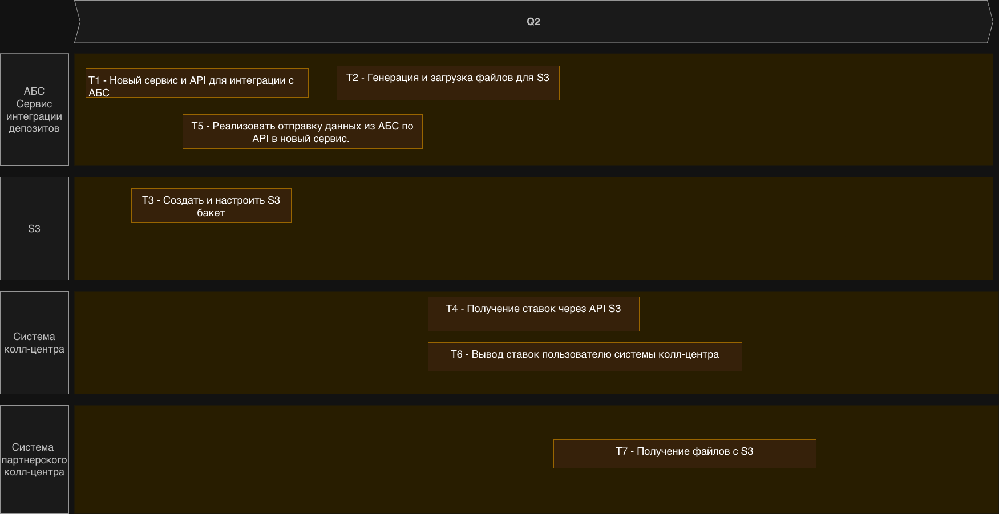

### **Название задачи:**

### **Автор:**

### **Дата:**

### **Функциональные требования**

Опишите здесь верхнеуровневые Use Cases. Их нужно оформить в виде таблицы с пошаговым описанием:

| **№** | **Действующие лица или системы**                             | **Use Case**                 | **Описание**                                                                                                                                               |
| :---: | :----------------------------------------------------------- | :--------------------------- | :--------------------------------------------------------------------------------------------------------------------------------------------------------- |
|  UC1  | Клиент Оператор колл-центра Система колл-центра АБС | Уточнение ставки по депозиту | 1. Клиент звонит в колл-центр. 2. Оператор колл-центра уточняет текущие ставки по депозитам. 3. Оператор предоставляет клиенту информацию о ставках. |

### **Нефункциональные требования**

Опишите здесь нефункциональные требования и архитектурно значимые требования.

| **№** | **Требование**                                                                                          |
| :---: | :------------------------------------------------------------------------------------------------------ |
|  R11  | Сотрудники колл-центра должны иметь доступ к актуальной информации о ставках по депозитам.              |
|  R12  | Сотрудники партнерского колл-центра должны иметь доступ к актуальной информации о ставках по депозитам. |

### **Решение**

> Приведите диаграммы контекста и контейнеров в модели C4. Опишите там основные компоненты и интеграции всех элементов решения.
> Также опишите, какой логикой вы руководствовались в ходе принятия решений и выбора технологий. Не забывайте, что необходимо учесть все функциональные и нефункциональные требования.

Диаграмма: [ссылка на диаграмму](c4.puml)

- Сотрудники колл-центра должны иметь доступ к актуальной информации о ставках по депозитам. Поэтому стоит сделать отдельный сервис, который будет получать информацию о ставках по депозитам из АБС.
- Сервис будет сохранять актуальную информацию по депозитам в файл S3, чтобы была возможность предоставить эту информацию сотрудникам партнерского колл-центра по прямой ссылке на файл.
- Система колл-центра будет обращаться к файлу на S3 для получения актуальной информации и избежать проблемы с несколькими источниками правды.
- Можно генерировать сохранять файлы в нескольких форматах, например json, text. Это позволит системе колл-центра читать в удобном для нее формате (json), а людям читать в удобном для них формате (text).

### **Альтернативы**

- Создавть сервис, который будет отдавать актуальную информацию о ставках по депозитам по API. Потребуется разрабатывать публичный API, для возможности обращаться к нему из партрнерского колл-центра. Также нужно время и желание партнерского колл-центра интегрироваться с этим API. Это может быть сложно и дорого, а также может привести к увеличению времени отклика и снижению доступности.

**Недостатки, ограничения, риски**

- Утечка ссылки на файл с актуальной информацией по депозитам. Поэтому стоит ограничить доступ к файлу по ссылке, например по IP-адресу или через корпоративный VPN.
- Кэширование файлов на S3 может быть слишком большим

**Задачи для реализации решения**

| **№** | **Задача**                                                                                                       |
| :---: | :--------------------------------------------------------------------------------------------------------------- |
|  T1   | Реализовать сервис, который будет получать информацию о ставках по депозитам из АБС и сохранять ее в файл на S3. |
|  T2   | Генерация и загрузка файлов с актуальной информацией по депозитам в S3.                                          |
|  T3   | Создать и настроить S3 бакет для хранения файлов с актуальной информацией по депозитам.                          |
|  T4   | Реализовать интеграцию системы колл-центра с файлом на S3 для получения актуальной информации по депозитам.      |
|  T5   | Реализовать отправку данных из AБС в сервис, который будет сохранять их в файл на S3.                            |
|  T6   | Вывод информации о ставках в системе колл-центра для сотрудников колл-центра.                                    |
|  T7   | Предоставить доступ к файлу на S3 для сотрудников партнерского колл-центра.                                      |

