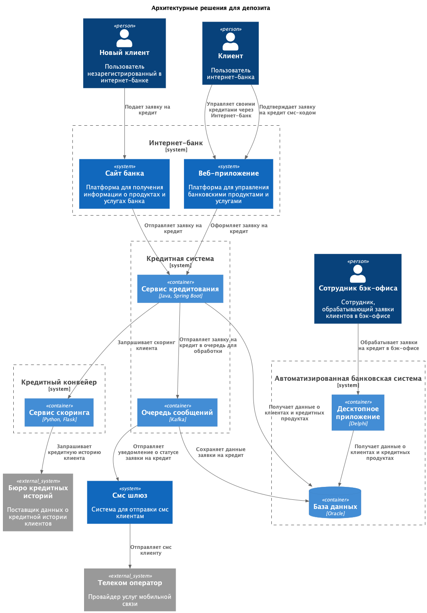

### **Название задачи:**

### **Автор:**

### **Дата:**

### **Функциональные требования**

Опишите здесь верхнеуровневые Use Cases. Их нужно оформить в виде таблицы с пошаговым описанием:

| **№** | **Действующие лица или системы**                                  | **Use Case**                        | **Описание**                                                                                                                                                                                                                                                                                                            |
| :---: | :---------------------------------------------------------------- | :---------------------------------- | :---------------------------------------------------------------------------------------------------------------------------------------------------------------------------------------------------------------------------------------------------------------------------------------------------------------------- |
|  UC1  | Новый клиент Сайт Система скоринга Менеджер банка АБС | Подача заявки на кредит             | 1. Клиент оставляет свои данные на сайте. 2. Система скоринга проверяет данные клиента. 3. Клиент получает СМС об предварительном решении. 4. Клиент приходит в отделение за кредитом 5. Менеджер работает с заявкой клиента в АБС. Если клиент новый, то офрмляет новую заявку.                            |
|  UC2  | Клиент Интернет-банк Система скоринга АБС Кредитный конвейер | Оформление кредита в интернет-банке | 1. Клиент видит в интернет-банке список доступных кредитов. 2. Клиент подает заявку на кредит. 3. Система скоринга проверяет данные клиента. 4. Клиент подтверждает оформление заявки СМС-кодом. 5. Заявка отправляется из АБС в кредитный конвеер 6. После изменения статуса заявки клиент получает СМС |

### **Нефункциональные требования**

Опишите здесь нефункциональные требования и архитектурно значимые требования.

| **№** | **Требование**                                                            |
| :---: | :------------------------------------------------------------------------ |
|  R1   | Сайт должен использовать шифрование трафика                               |
|  R2   | Интернет-банк должен использовать систему шифрования данных               |
|  R4   | Для баз данных следует использовать MS SQL и Oracle                       |
|  R6   | При добавлении микросервисной архитектуры использовать Kafka для очередей |

### **Решение**

> Приведите диаграммы контекста и контейнеров в модели C4. Опишите там основные компоненты и интеграции всех элементов решения.

> Также опишите, какой логикой вы руководствовались в ходе принятия решений и выбора технологий. Не забывайте, что необходимо учесть все функциональные и нефункциональные требования.

Диаграмма: [ссылка на диаграмму](c4.puml)

### **Альтернативы**

- Обрабатывать заявки на кредит в рамках старого монолитного приложения.

**Недостатки, ограничения, риски**

- Старое монолитное приложение имеет сложности с подключение нового функционала (например Kafka, микросервисы и т.д.). Поэтому при добавлении нового функционала может возникать проблема во всей система, так как оно живет в одном ЦОД с более важными сервисами, например АБС. Поэтому стоит максимально мониторить нагрузку на старое приложение и при необходимости масштабировать его.
